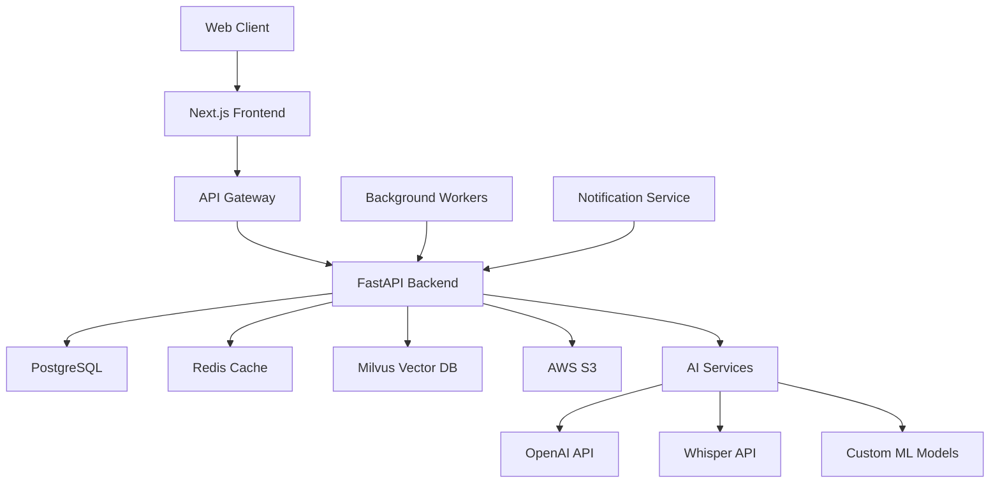

# JARVIS 개발 PRD - AI 페어 프로그래밍용
## 버전 1.0 | 2025년 9월 15일

---

## 🚀 개발 개요

**목표**: AI 페어 프로그래밍을 활용한 JARVIS MVP 개발  
**개발 방식**: 바이브 코딩 (AI 협업 기반 개발)  
**개발 기간**: 16주 (4개월)  
**핵심 원칙**: 모듈식 개발, 테스트 주도 개발, 지속적 통합

---

## 📋 기술 스택 상세 명세

### Frontend Stack
```javascript
// Core Framework
- React 18.2.0 (Hooks, Suspense, Concurrent Features)
- Next.js 14.0.0 (App Router, Server Components)
- TypeScript 5.0+ (Strict mode enabled)

// UI/UX Libraries
- Tailwind CSS 3.3.0 (Utility-first styling)
- Headless UI 1.7.0 (Accessible components)
- Framer Motion 10.0.0 (Animations)
- React Hook Form 7.45.0 (Form handling)
- Zod 3.22.0 (Schema validation)

// Data Management
- TanStack Query 4.32.0 (Server state)
- Zustand 4.4.0 (Client state)
- Axios 1.5.0 (HTTP client)

// Development Tools
- ESLint + Prettier (Code formatting)
- Husky + lint-staged (Git hooks)
- Storybook 7.0.0 (Component development)
```

### Backend Stack
```python
# Core Framework
- FastAPI 0.103.0 (Python async web framework)
- Python 3.11+ (Latest features)
- Uvicorn 0.23.0 (ASGI server)

# Database & Storage
- PostgreSQL 15.0 (Primary database)
- Redis 7.0 (Caching & sessions)
- Milvus 2.3.0 (Vector database for embeddings)
- AWS S3 (File storage)

# AI/ML Stack
- OpenAI API (GPT-4, Whisper)
- LangChain 0.0.300+ (AI orchestration)
- Sentence Transformers (Embeddings)
- spaCy 3.6.0 (NLP processing)

# Development Tools
- Poetry (Dependency management)
- Pytest (Testing)
- Black + isort (Code formatting)
- Pre-commit hooks
```

### Infrastructure
```yaml
# Deployment
- Docker + Docker Compose
- AWS ECS (Container orchestration)
- AWS ALB (Load balancing)
- AWS CloudFront (CDN)

# Monitoring & Logging
- AWS CloudWatch
- Sentry (Error tracking)
- Datadog (APM)

# CI/CD
- GitHub Actions
- AWS ECR (Container registry)
```

---

## 🏗️ 시스템 아키텍처

### 전체 시스템 구조


### 데이터베이스 스키마
```sql
-- 사용자 관리
CREATE TABLE users (
    id UUID PRIMARY KEY DEFAULT gen_random_uuid(),
    email VARCHAR(255) UNIQUE NOT NULL,
    password_hash VARCHAR(255),
    display_name VARCHAR(100),
    avatar_url TEXT,
    subscription_tier VARCHAR(20) DEFAULT 'free',
    created_at TIMESTAMP DEFAULT NOW(),
    updated_at TIMESTAMP DEFAULT NOW()
);

-- 프로젝트 관리
CREATE TABLE projects (
    id UUID PRIMARY KEY DEFAULT gen_random_uuid(),
    user_id UUID REFERENCES users(id) ON DELETE CASCADE,
    name VARCHAR(200) NOT NULL,
    description TEXT,
    settings JSONB DEFAULT '{}',
    created_at TIMESTAMP DEFAULT NOW(),
    updated_at TIMESTAMP DEFAULT NOW()
);

-- 컨텐츠 분석
CREATE TABLE content_items (
    id UUID PRIMARY KEY DEFAULT gen_random_uuid(),
    project_id UUID REFERENCES projects(id) ON DELETE CASCADE,
    user_id UUID REFERENCES users(id) ON DELETE CASCADE,
    title VARCHAR(300),
    content_type VARCHAR(50), -- 'meeting', 'document', 'video', 'note'
    file_url TEXT,
    file_size BIGINT,
    duration INTEGER, -- for audio/video in seconds
    status VARCHAR(20) DEFAULT 'processing', -- 'processing', 'completed', 'failed'
    created_at TIMESTAMP DEFAULT NOW(),
    updated_at TIMESTAMP DEFAULT NOW()
);

-- 분석 결과
CREATE TABLE analysis_results (
    id UUID PRIMARY KEY DEFAULT gen_random_uuid(),
    content_item_id UUID REFERENCES content_items(id) ON DELETE CASCADE,
    summary TEXT,
    key_points JSONB DEFAULT '[]',
    participants JSONB DEFAULT '[]',
    action_items JSONB DEFAULT '[]',
    sentiment_analysis JSONB DEFAULT '{}',
    topics JSONB DEFAULT '[]',
    embeddings VECTOR(1536), -- OpenAI embedding dimension
    processing_metadata JSONB DEFAULT '{}',
    created_at TIMESTAMP DEFAULT NOW()
);

-- 공유 및 바이럴 기능
CREATE TABLE shares (
    id UUID PRIMARY KEY DEFAULT gen_random_uuid(),
    content_item_id UUID REFERENCES content_items(id) ON DELETE CASCADE,
    user_id UUID REFERENCES users(id) ON DELETE CASCADE,
    share_type VARCHAR(50), -- 'public_link', 'social_media', 'email'
    share_url TEXT UNIQUE,
    access_count INTEGER DEFAULT 0,
    settings JSONB DEFAULT '{}',
    expires_at TIMESTAMP,
    created_at TIMESTAMP DEFAULT NOW()
);

-- 사용자 개인화 데이터
CREATE TABLE user_preferences (
    id UUID PRIMARY KEY DEFAULT gen_random_uuid(),
    user_id UUID REFERENCES users(id) ON DELETE CASCADE,
    interests JSONB DEFAULT '[]',
    notification_settings JSONB DEFAULT '{}',
    dashboard_config JSONB DEFAULT '{}',
    created_at TIMESTAMP DEFAULT NOW(),
    updated_at TIMESTAMP DEFAULT NOW()
);
```

---

## 🔧 MVP 개발 단계별 구현

### Phase 1: 기본 인프라 구축 (Week 1-2)

#### Week 1: 프로젝트 설정 및 기본 구조
```bash
# 1.1 프로젝트 초기화
mkdir jarvis-mvp
cd jarvis-mvp

# Frontend 설정
npx create-next-app@latest frontend --typescript --tailwind --app
cd frontend
npm install @tanstack/react-query zustand axios react-hook-form zod
npm install @headlessui/react @heroicons/react framer-motion
npm install -D @types/node @typescript-eslint/eslint-plugin

# Backend 설정
cd ../
mkdir backend
cd backend
poetry init
poetry add fastapi uvicorn sqlalchemy asyncpg redis python-multipart
poetry add openai langchain sentence-transformers spacy
poetry add -D pytest black isort pre-commit
```

#### 구현 태스크 1.1: Next.js 프로젝트 구조 설정

**목적**: JARVIS 애플리케이션의 기본 레이아웃과 전역 설정을 구성합니다. 이는 모든 페이지에 공통으로 적용되는 메타데이터, 폰트, 그리고 전역 제공자(Provider)들을 설정하는 핵심 파일입니다.

**아키텍처 역할**: Next.js 13+ App Router의 루트 레이아웃으로, 애플리케이션의 HTML 구조와 전역 상태 관리를 담당합니다.

```typescript
// app/layout.tsx - 애플리케이션 루트 레이아웃 (전역 설정 및 메타데이터 관리)
import type { Metadata } from 'next'
import { Inter } from 'next/font/google'
import './globals.css'
import { Providers } from '@/components/providers'

// 🎨 폰트 최적화: Google Fonts를 사전 로드하여 성능 향상
const inter = Inter({ subsets: ['latin'] })

// 📄 SEO 최적화: 기본 메타데이터 설정으로 검색 엔진 최적화
export const metadata: Metadata = {
  title: 'JARVIS - AI Meeting Assistant',
  description: 'Transform your meetings into actionable insights',
  // 추후 OpenGraph, Twitter Cards 등 소셜 미디어 메타데이터 추가 예정
}

// 🏗️ 루트 레이아웃: 모든 페이지의 공통 구조 정의
export default function RootLayout({
  children,
}: {
  children: React.ReactNode
}) {
  return (
    <html lang="ko"> {/* 한국어 설정으로 접근성 향상 */}
      <body className={inter.className}>
        {/* 🔧 전역 제공자: 인증, 상태관리, 테마 등 전역 컨텍스트 제공 */}
        <Providers>
          {children} {/* 각 페이지 컴포넌트가 렌더링되는 영역 */}
        </Providers>
      </body>
    </html>
  )
}
```

#### 구현 태스크 1.2: FastAPI 기본 구조

**목적**: JARVIS 백엔드 API 서버의 진입점을 설정합니다. 이 파일은 FastAPI 애플리케이션 인스턴스 생성, 미들웨어 설정, 라우터 등록 등 서버의 핵심 구성을 담당합니다.

**아키텍처 역할**: 마이크로서비스 아키텍처의 API 게이트웨이 역할을 하며, 모든 HTTP 요청의 진입점이 됩니다.

```python
# main.py - FastAPI 애플리케이션 메인 진입점 (서버 설정 및 라우팅 구성)
from fastapi import FastAPI, Depends
from fastapi.middleware.cors import CORSMiddleware
from fastapi.middleware.gzip import GZipMiddleware
import uvicorn

from app.core.config import settings
from app.api.routes import router
from app.core.database import engine
from app.models import Base

# 🗄️ 데이터베이스 초기화: 애플리케이션 시작 시 모든 테이블 생성
Base.metadata.create_all(bind=engine)

# 🚀 FastAPI 애플리케이션 인스턴스 생성
app = FastAPI(
    title="JARVIS API",
    description="AI Meeting Assistant API",
    version="1.0.0"
    # docs_url="/docs" - 자동 생성되는 Swagger UI 문서
    # redoc_url="/redoc" - 자동 생성되는 ReDoc 문서
)

# 🌐 CORS 미들웨어: 프론트엔드와의 통신을 위한 교차 출처 리소스 공유 설정
app.add_middleware(
    CORSMiddleware,
    allow_origins=settings.ALLOWED_ORIGINS,  # 허용된 도메인 목록
    allow_credentials=True,  # 쿠키/인증 정보 허용
    allow_methods=["*"],     # 모든 HTTP 메서드 허용
    allow_headers=["*"],     # 모든 헤더 허용
)

# 📦 압축 미들웨어: 응답 데이터 압축으로 네트워크 성능 최적화
app.add_middleware(GZipMiddleware, minimum_size=1000)

# 🛣️ API 라우터 등록: 모든 엔드포인트를 '/api/v1' 접두사로 그룹화
app.include_router(router, prefix="/api/v1")

# 🔧 개발 서버 실행: 운영 환경에서는 Gunicorn/Uvicorn 별도 사용
if __name__ == "__main__":
    uvicorn.run(app, host="0.0.0.0", port=8000)
```

#### Week 2: 인증 시스템 구현

**목적**: 사용자 인증과 세션 관리를 담당하는 시스템을 구축합니다. JWT 토큰 기반 인증으로 보안성을 확보하고, React Context API를 활용하여 전역 인증 상태를 관리합니다.

**아키텍처 역할**: 클라이언트 사이드 인증 상태 관리와 서버와의 인증 통신을 담당하는 핵심 컴포넌트입니다.

```typescript
// components/auth/AuthProvider.tsx - 전역 인증 상태 관리 (React Context 패턴)
'use client'
import { createContext, useContext, useEffect, useState } from 'react'
import { User } from '@/types/auth'
import { authApi } from '@/lib/api/auth'

// 🔐 인증 컨텍스트 타입 정의: 전역 인증 상태와 메서드들
interface AuthContextType {
  user: User | null          // 현재 로그인된 사용자 정보
  login: (email: string, password: string) => Promise<void>   // 로그인 함수
  logout: () => Promise<void>                                 // 로그아웃 함수
  isLoading: boolean         // 인증 상태 확인 중 여부
}

// 🌍 React Context 생성: 컴포넌트 트리 전체에서 인증 상태 공유
const AuthContext = createContext<AuthContextType | undefined>(undefined)

// 🏗️ 인증 제공자 컴포넌트: 모든 하위 컴포넌트에 인증 상태 제공
export function AuthProvider({ children }: { children: React.ReactNode }) {
  const [user, setUser] = useState<User | null>(null)     // 사용자 정보 상태
  const [isLoading, setIsLoading] = useState(true)        // 로딩 상태

  // 🚀 컴포넌트 마운트 시 기존 인증 상태 확인
  useEffect(() => {
    checkAuth()
  }, [])

  // 🔍 인증 상태 확인: localStorage의 토큰으로 사용자 정보 복원
  const checkAuth = async () => {
    try {
      const token = localStorage.getItem('token')
      if (token) {
        // 토큰이 존재하면 서버에서 사용자 정보 가져오기
        const userData = await authApi.getCurrentUser()
        setUser(userData)
      }
    } catch (error) {
      // 토큰이 유효하지 않으면 제거
      localStorage.removeItem('token')
    } finally {
      setIsLoading(false)
    }
  }

  // 🔑 로그인 처리: 이메일/패스워드로 인증 후 토큰 저장
  const login = async (email: string, password: string) => {
    const { user, token } = await authApi.login(email, password)
    localStorage.setItem('token', token)  // JWT 토큰 로컬 저장
    setUser(user)                         // 사용자 상태 업데이트
  }

  // 🚪 로그아웃 처리: 토큰 제거 및 사용자 상태 초기화
  const logout = async () => {
    localStorage.removeItem('token')
    setUser(null)
    // 추후 서버에 로그아웃 알림 API 호출 추가 가능
  }

  return (
    <AuthContext.Provider value={{ user, login, logout, isLoading }}>
      {children}
    </AuthContext.Provider>
  )
}

// 🎣 커스텀 훅: 인증 컨텍스트를 안전하게 사용하기 위한 헬퍼
export const useAuth = () => {
  const context = useContext(AuthContext)
  if (!context) throw new Error('useAuth must be used within AuthProvider')
  return context
}
```

**백엔드 JWT 인증 시스템 구현**

**목적**: 서버 사이드에서 JWT 토큰 기반 인증을 처리합니다. 패스워드 해싱, 토큰 생성/검증, 사용자 인증을 담당하는 핵심 보안 모듈입니다.

**아키텍처 역할**: 보안 계층의 핵심으로, 모든 보호된 엔드포인트에서 사용자 인증을 담당합니다.

```python
# app/core/auth.py - JWT 토큰 기반 인증 시스템 (보안 핵심 모듈)
from datetime import datetime, timedelta
from typing import Optional
import jwt
from passlib.context import CryptContext
from fastapi import Depends, HTTPException, status
from fastapi.security import HTTPBearer, HTTPAuthorizationCredentials

from app.core.config import settings
from app.models.user import User
from app.core.database import get_db

# 🔒 패스워드 암호화 컨텍스트: bcrypt 알고리즘으로 안전한 해싱
pwd_context = CryptContext(schemes=["bcrypt"], deprecated="auto")

# 🛡️ HTTP Bearer 토큰 스키마: Authorization 헤더에서 JWT 토큰 추출
security = HTTPBearer()

class AuthManager:
    """인증 관련 유틸리티 메서드들을 모아놓은 클래스"""
    
    @staticmethod
    def verify_password(plain_password: str, hashed_password: str) -> bool:
        """🔍 입력된 비밀번호와 해시된 비밀번호 비교 검증"""
        return pwd_context.verify(plain_password, hashed_password)

    @staticmethod
    def get_password_hash(password: str) -> str:
        """🔐 평문 비밀번호를 bcrypt로 해시화"""
        return pwd_context.hash(password)

    @staticmethod
    def create_access_token(data: dict, expires_delta: Optional[timedelta] = None):
        """🎫 JWT 액세스 토큰 생성: 사용자 정보와 만료시간 포함"""
        to_encode = data.copy()
        
        # 만료시간 설정 (기본: 설정 파일의 값 사용)
        if expires_delta:
            expire = datetime.utcnow() + expires_delta
        else:
            expire = datetime.utcnow() + timedelta(minutes=settings.ACCESS_TOKEN_EXPIRE_MINUTES)
        
        # JWT 페이로드에 만료시간 추가
        to_encode.update({"exp": expire})
        
        # JWT 토큰 생성 및 반환
        encoded_jwt = jwt.encode(to_encode, settings.SECRET_KEY, algorithm=settings.ALGORITHM)
        return encoded_jwt

    @staticmethod
    def verify_token(token: str) -> dict:
        """🔓 JWT 토큰 검증 및 페이로드 추출"""
        try:
            # 토큰 디코딩 및 서명 검증
            payload = jwt.decode(token, settings.SECRET_KEY, algorithms=[settings.ALGORITHM])
            return payload
        except jwt.PyJWTError:
            # 토큰이 유효하지 않거나 만료된 경우
            raise HTTPException(
                status_code=status.HTTP_401_UNAUTHORIZED,
                detail="Could not validate credentials",
            )

# 🔐 의존성 주입: 보호된 엔드포인트에서 현재 사용자 정보 추출
async def get_current_user(
    credentials: HTTPAuthorizationCredentials = Depends(security),
    db = Depends(get_db)
) -> User:
    """
    Authorization 헤더의 JWT 토큰으로부터 현재 사용자 정보를 추출
    보호된 모든 API 엔드포인트에서 이 함수를 의존성으로 사용
    """
    # Authorization 헤더에서 토큰 추출
    token = credentials.credentials
    
    # 토큰 검증 및 페이로드 추출
    payload = AuthManager.verify_token(token)
    user_id = payload.get("sub")  # 토큰의 subject(사용자 ID)
    
    if user_id is None:
        raise HTTPException(
            status_code=status.HTTP_401_UNAUTHORIZED,
            detail="Could not validate credentials",
        )
    
    # 데이터베이스에서 사용자 정보 조회
    user = db.query(User).filter(User.id == user_id).first()
    if user is None:
        raise HTTPException(
            status_code=status.HTTP_401_UNAUTHORIZED,
            detail="User not found",
        )
    
    return user  # 인증된 사용자 객체 반환
```

### Phase 2: 파일 업로드 및 처리 (Week 3-4)

#### Week 3: 파일 업로드 시스템

**목적**: 사용자가 다양한 형식의 파일을 손쉽게 업로드할 수 있는 인터페이스를 제공합니다. 드래그 앤 드롭, 진행률 표시, 파일 검증 등 현대적인 UX 패턴을 구현합니다.

**아키텍처 역할**: 클라이언트-서버 파일 전송의 프론트엔드 진입점으로, 사용자 경험 최적화와 파일 검증을 담당합니다.

```typescript
// components/upload/FileUploader.tsx - 파일 업로드 컴포넌트 (드래그앤드롭 + 진행률)
'use client'
import { useCallback, useState } from 'react'
import { useDropzone } from 'react-dropzone'
import { uploadApi } from '@/lib/api/upload'
import { FileIcon, CloudUploadIcon } from '@heroicons/react/24/outline'

// 📝 컴포넌트 Props 타입 정의
interface FileUploaderProps {
  onUploadComplete: (fileId: string) => void    // 업로드 완료 콜백
  acceptedTypes?: string[]                      // 허용할 파일 타입들
  maxSize?: number                              // 최대 파일 크기
}

export function FileUploader({ 
  onUploadComplete, 
  acceptedTypes = ['audio/*', '.txt', '.md', '.docx', '.srt', '.vtt'],  // JARVIS 지원 형식
  maxSize = 100 * 1024 * 1024 // 100MB 제한
}: FileUploaderProps) {
  // 🔄 업로드 상태 관리
  const [uploading, setUploading] = useState(false)    // 업로드 진행 여부
  const [progress, setProgress] = useState(0)          // 업로드 진행률 (0-100)

  // 📤 파일 드롭 처리: 사용자가 파일을 선택하거나 드래그했을 때 실행
  const onDrop = useCallback(async (acceptedFiles: File[]) => {
    if (acceptedFiles.length === 0) return

    const file = acceptedFiles[0]  // 단일 파일만 처리
    setUploading(true)
    setProgress(0)

    try {
      // 🚀 API 호출: 파일 업로드 및 실시간 진행률 추적
      const fileId = await uploadApi.uploadFile(file, (progressEvent) => {
        const percentCompleted = Math.round(
          (progressEvent.loaded * 100) / progressEvent.total
        )
        setProgress(percentCompleted)  // 진행률 실시간 업데이트
      })

      // ✅ 업로드 성공 시 부모 컴포넌트에 알림
      onUploadComplete(fileId)
    } catch (error) {
      console.error('Upload failed:', error)
      // 🚨 에러 처리: 추후 토스트 알림이나 에러 상태 표시 추가
    } finally {
      setUploading(false)
      setProgress(0)
    }
  }, [onUploadComplete])

  // 🎯 react-dropzone 훅: 드래그앤드롭 및 파일 선택 기능
  const { getRootProps, getInputProps, isDragActive } = useDropzone({
    onDrop,
    accept: acceptedTypes.reduce((acc, type) => {
      acc[type] = []
      return acc
    }, {} as Record<string, string[]>),  // 파일 타입 제한
    maxSize,                            // 파일 크기 제한
    multiple: false                     // 단일 파일만 허용
  })

  return (
    <div
      {...getRootProps()}
      className={`
        border-2 border-dashed rounded-lg p-8 text-center cursor-pointer
        transition-colors duration-200
        ${isDragActive 
          ? 'border-blue-500 bg-blue-50'     // 🎨 드래그 중 스타일
          : 'border-gray-300 hover:border-gray-400'  // 기본 스타일
        }
        ${uploading ? 'pointer-events-none opacity-50' : ''}  // 업로드 중 비활성화
      `}
    >
      <input {...getInputProps()} />  {/* 숨겨진 파일 입력 요소 */}
      
      {uploading ? (
        // 📊 업로드 진행 상태 표시
        <div className="space-y-4">
          <div className="animate-spin w-8 h-8 mx-auto">
            <CloudUploadIcon className="w-8 h-8 text-blue-500" />
          </div>
          {/* 진행률 바 */}
          <div className="w-full bg-gray-200 rounded-full h-2">
            <div 
              className="bg-blue-500 h-2 rounded-full transition-all duration-300"
              style={{ width: `${progress}%` }}
            />
          </div>
          <p className="text-sm text-gray-600">
            업로드 중... {progress}%
          </p>
        </div>
      ) : (
        // 📁 파일 선택 안내 화면
        <div className="space-y-4">
          <FileIcon className="w-12 h-12 mx-auto text-gray-400" />
          <div>
            <p className="text-lg font-medium text-gray-900">
              파일을 드래그하거나 클릭하여 업로드
            </p>
            <p className="text-sm text-gray-500">
              오디오, 문서, 자막 파일 지원 (최대 100MB)
            </p>
          </div>
        </div>
      )}
    </div>
  )
}
```

**백엔드 파일 업로드 API 구현**

**목적**: 클라이언트에서 전송된 파일을 검증하고 AWS S3에 안전하게 저장합니다. 파일 메타데이터를 데이터베이스에 기록하고 백그라운드 분석 작업을 큐에 추가합니다.

**아키텍처 역할**: 파일 스토리지 계층과 비즈니스 로직 계층을 연결하는 컨트롤러 역할을 합니다.

```python
# app/api/routes/upload.py - 파일 업로드 API 엔드포인트 (S3 스토리지 연동)
from fastapi import APIRouter, Depends, HTTPException, UploadFile, File
from fastapi.responses import JSONResponse
import boto3
from uuid import uuid4
import os

from app.core.auth import get_current_user
from app.models.user import User
from app.models.content import ContentItem
from app.core.database import get_db
from app.core.config import settings

router = APIRouter()

# 🪣 AWS S3 클라이언트 초기화: 파일 저장소 연결
s3_client = boto3.client(
    's3',
    aws_access_key_id=settings.AWS_ACCESS_KEY_ID,
    aws_secret_access_key=settings.AWS_SECRET_ACCESS_KEY,
    region_name=settings.AWS_REGION
)

@router.post("/upload")
async def upload_file(
    file: UploadFile = File(...),
    project_id: str = None,
    current_user: User = Depends(get_current_user),
    db = Depends(get_db)
):
    # 파일 타입 검증
    allowed_types = [
        'audio/mpeg', 'audio/wav', 'audio/mp4', 'audio/m4a',
        'text/plain', 'text/markdown', 
        'application/vnd.openxmlformats-officedocument.wordprocessingml.document',
        'text/vtt', 'application/x-subrip'
    ]
    
    if file.content_type not in allowed_types:
        raise HTTPException(
            status_code=400,
            detail=f"Unsupported file type: {file.content_type}"
        )
    
    # 파일 크기 검증 (100MB)
    if file.size > 100 * 1024 * 1024:
        raise HTTPException(
            status_code=400,
            detail="File size exceeds 100MB limit"
        )
    
    try:
        # 고유 파일명 생성
        file_id = str(uuid4())
        file_extension = os.path.splitext(file.filename)[1]
        s3_key = f"uploads/{current_user.id}/{file_id}{file_extension}"
        
        # S3에 업로드
        s3_client.upload_fileobj(
            file.file,
            settings.S3_BUCKET,
            s3_key,
            ExtraArgs={'ContentType': file.content_type}
        )
        
        # 데이터베이스에 메타데이터 저장
        content_item = ContentItem(
            id=file_id,
            user_id=current_user.id,
            project_id=project_id,
            title=file.filename,
            content_type=get_content_type(file.content_type),
            file_url=f"s3://{settings.S3_BUCKET}/{s3_key}",
            file_size=file.size,
            status='uploaded'
        )
        
        db.add(content_item)
        db.commit()
        
        # 백그라운드 처리 큐에 추가
        from app.tasks.analysis import process_content
        process_content.delay(file_id)
        
        return JSONResponse({
            "file_id": file_id,
            "status": "uploaded",
            "message": "File uploaded successfully and queued for processing"
        })
        
    except Exception as e:
        raise HTTPException(
            status_code=500,
            detail=f"Upload failed: {str(e)}"
        )

def get_content_type(mime_type: str) -> str:
    if mime_type.startswith('audio/'):
        return 'meeting'
    elif mime_type in ['text/plain', 'text/markdown']:
        return 'document'
    elif 'word' in mime_type:
        return 'document'
    elif mime_type in ['text/vtt', 'application/x-subrip']:
        return 'subtitle'
    else:
        return 'unknown'
```

#### Week 4: 백그라운드 처리 시스템

**목적**: 파일 분석과 같은 시간 소모적인 작업을 비동기로 처리하여 API 응답 속도를 최적화합니다. Celery와 Redis를 활용한 분산 작업 큐 시스템을 구축합니다.

**아키텍처 역할**: 마이크로서비스 아키텍처의 작업 처리 계층으로, CPU 집약적인 AI 분석 작업을 별도 워커에서 처리합니다.

```python
# app/tasks/analysis.py - Celery 백그라운드 작업 시스템 (비동기 AI 분석 처리)
from celery import Celery
import openai
from sqlalchemy.orm import sessionmaker
import whisper
import tempfile
import boto3

from app.core.config import settings
from app.models.content import ContentItem
from app.models.analysis import AnalysisResult
from app.core.database import engine

# 🚀 Celery 애플리케이션 인스턴스: 분산 작업 큐 시스템
celery_app = Celery(
    "jarvis_tasks",                    # 앱 이름
    broker=settings.REDIS_URL,         # 메시지 브로커 (작업 큐)
    backend=settings.REDIS_URL         # 결과 저장소
)

# 🗄️ 데이터베이스 세션 팩토리: 워커 프로세스용 DB 연결
SessionLocal = sessionmaker(bind=engine)

# 🤖 OpenAI API 키 설정: AI 분석 서비스 연동
openai.api_key = settings.OPENAI_API_KEY

@celery_app.task
def process_content(content_id: str):
    """컨텐츠 분석 메인 태스크"""
    db = SessionLocal()
    
    try:
        content_item = db.query(ContentItem).filter(
            ContentItem.id == content_id
        ).first()
        
        if not content_item:
            raise Exception(f"Content item {content_id} not found")
        
        # 상태 업데이트
        content_item.status = 'processing'
        db.commit()
        
        # 파일 타입에 따른 처리
        if content_item.content_type == 'meeting':
            result = process_audio_content(content_item)
        elif content_item.content_type == 'document':
            result = process_document_content(content_item)
        elif content_item.content_type == 'subtitle':
            result = process_subtitle_content(content_item)
        else:
            raise Exception(f"Unsupported content type: {content_item.content_type}")
        
        # 분석 결과 저장
        analysis_result = AnalysisResult(
            content_item_id=content_id,
            summary=result['summary'],
            key_points=result['key_points'],
            participants=result.get('participants', []),
            action_items=result.get('action_items', []),
            sentiment_analysis=result.get('sentiment', {}),
            topics=result.get('topics', []),
            embeddings=result.get('embeddings'),
            processing_metadata=result.get('metadata', {})
        )
        
        db.add(analysis_result)
        content_item.status = 'completed'
        db.commit()
        
        # 사용자에게 완료 알림 전송
        send_completion_notification.delay(content_id)
        
    except Exception as e:
        content_item.status = 'failed'
        db.commit()
        raise e
    finally:
        db.close()

def process_audio_content(content_item: ContentItem) -> dict:
    """오디오 파일 처리 (음성 인식 + 분석)"""
    # S3에서 파일 다운로드
    s3_client = boto3.client('s3')
    
    with tempfile.NamedTemporaryFile(suffix='.mp3') as temp_file:
        bucket_name = settings.S3_BUCKET
        s3_key = content_item.file_url.replace(f's3://{bucket_name}/', '')
        
        s3_client.download_fileobj(bucket_name, s3_key, temp_file)
        temp_file.seek(0)
        
        # Whisper로 음성 인식
        model = whisper.load_model("base")
        transcript_result = model.transcribe(temp_file.name)
        transcript = transcript_result["text"]
        
        # OpenAI로 분석
        return analyze_text_content(transcript)

def process_document_content(content_item: ContentItem) -> dict:
    """문서 파일 처리"""
    # S3에서 텍스트 추출
    text_content = extract_text_from_s3(content_item.file_url)
    return analyze_text_content(text_content)

def analyze_text_content(text: str) -> dict:
    """텍스트 컨텐츠 AI 분석"""
    try:
        # GPT-4로 분석
        response = openai.ChatCompletion.create(
            model="gpt-4",
            messages=[
                {
                    "role": "system",
                    "content": """
                    다음 텍스트를 분석하여 JSON 형식으로 결과를 반환하세요:
                    1. summary: 전체 요약 (3-5 문장)
                    2. key_points: 주요 포인트 배열
                    3. participants: 참여자 정보 (이름, 역할)
                    4. action_items: 액션 아이템 배열
                    5. sentiment: 전체적인 감정 분석
                    6. topics: 주요 주제/키워드 배열
                    """
                },
                {"role": "user", "content": text}
            ],
            temperature=0.3
        )
        
        analysis = eval(response.choices[0].message.content)
        
        # 임베딩 생성
        embedding_response = openai.Embedding.create(
            model="text-embedding-ada-002",
            input=text[:8000]  # 토큰 제한
        )
        
        analysis['embeddings'] = embedding_response.data[0].embedding
        analysis['metadata'] = {
            'model_used': 'gpt-4',
            'processing_timestamp': str(datetime.utcnow()),
            'text_length': len(text)
        }
        
        return analysis
        
    except Exception as e:
        raise Exception(f"Analysis failed: {str(e)}")
```

### Phase 3: 분석 결과 UI 및 대시보드 (Week 5-8)

#### Week 5-6: 분석 결과 표시 컴포넌트
```typescript
// components/analysis/AnalysisResult.tsx
'use client'
import { useState } from 'react'
import { AnalysisData } from '@/types/analysis'
import { 
  ChartBarIcon, 
  UserGroupIcon, 
  ClipboardDocumentListIcon,
  ShareIcon 
} from '@heroicons/react/24/outline'

interface AnalysisResultProps {
  analysis: AnalysisData
  onShare: (shareType: string) => void
}

export function AnalysisResult({ analysis, onShare }: AnalysisResultProps) {
  const [activeTab, setActiveTab] = useState('summary')

  const tabs = [
    { id: 'summary', label: '요약', icon: ClipboardDocumentListIcon },
    { id: 'participants', label: '참여자', icon: UserGroupIcon },
    { id: 'insights', label: '인사이트', icon: ChartBarIcon },
    { id: 'share', label: '공유', icon: ShareIcon }
  ]

  return (
    <div className="bg-white rounded-lg shadow-lg overflow-hidden">
      {/* 탭 네비게이션 */}
      <div className="border-b border-gray-200">
        <nav className="flex space-x-8 px-6">
          {tabs.map((tab) => {
            const Icon = tab.icon
            return (
              <button
                key={tab.id}
                onClick={() => setActiveTab(tab.id)}
                className={`
                  flex items-center space-x-2 py-4 px-1 border-b-2 font-medium text-sm
                  ${activeTab === tab.id
                    ? 'border-blue-500 text-blue-600'
                    : 'border-transparent text-gray-500 hover:text-gray-700 hover:border-gray-300'
                  }
                `}
              >
                <Icon className="w-5 h-5" />
                <span>{tab.label}</span>
              </button>
            )
          })}
        </nav>
      </div>

      {/* 탭 컨텐츠 */}
      <div className="p-6">
        {activeTab === 'summary' && (
          <SummaryTab analysis={analysis} />
        )}
        {activeTab === 'participants' && (
          <ParticipantsTab participants={analysis.participants} />
        )}
        {activeTab === 'insights' && (
          <InsightsTab analysis={analysis} />
        )}
        {activeTab === 'share' && (
          <ShareTab analysis={analysis} onShare={onShare} />
        )}
      </div>
    </div>
  )
}

function SummaryTab({ analysis }: { analysis: AnalysisData }) {
  return (
    <div className="space-y-6">
      {/* 전체 요약 */}
      <div>
        <h3 className="text-lg font-semibold text-gray-900 mb-3">
          전체 요약
        </h3>
        <p className="text-gray-700 leading-relaxed">
          {analysis.summary}
        </p>
      </div>

      {/* 주요 포인트 */}
      <div>
        <h3 className="text-lg font-semibold text-gray-900 mb-3">
          주요 포인트
        </h3>
        <ul className="space-y-2">
          {analysis.key_points.map((point, index) => (
            <li key={index} className="flex items-start space-x-3">
              <div className="w-2 h-2 bg-blue-500 rounded-full mt-2 flex-shrink-0" />
              <span className="text-gray-700">{point}</span>
            </li>
          ))}
        </ul>
      </div>

      {/* 액션 아이템 */}
      {analysis.action_items && analysis.action_items.length > 0 && (
        <div>
          <h3 className="text-lg font-semibold text-gray-900 mb-3">
            액션 아이템
          </h3>
          <div className="space-y-3">
            {analysis.action_items.map((item, index) => (
              <div key={index} className="bg-yellow-50 border border-yellow-200 rounded-lg p-4">
                <div className="flex items-center justify-between">
                  <span className="font-medium text-gray-900">{item.task}</span>
                  {item.assignee && (
                    <span className="text-sm text-gray-600">
                      담당: {item.assignee}
                    </span>
                  )}
                </div>
                {item.deadline && (
                  <span className="text-sm text-gray-500">
                    마감: {item.deadline}
                  </span>
                )}
              </div>
            ))}
          </div>
        </div>
      )}
    </div>
  )
}

function ParticipantsTab({ participants }: { participants: any[] }) {
  return (
    <div className="space-y-4">
      <h3 className="text-lg font-semibold text-gray-900">
        참여자 분석
      </h3>
      
      <div className="grid grid-cols-1 md:grid-cols-2 gap-4">
        {participants.map((participant, index) => (
          <div key={index} className="bg-gray-50 rounded-lg p-4">
            <div className="flex items-center space-x-3 mb-3">
              <div className="w-10 h-10 bg-blue-500 rounded-full flex items-center justify-center">
                <span className="text-white font-medium">
                  {participant.name?.[0] || '?'}
                </span>
              </div>
              <div>
                <h4 className="font-medium text-gray-900">
                  {participant.name || '참여자'}
                </h4>
                {participant.role && (
                  <p className="text-sm text-gray-600">{participant.role}</p>
                )}
              </div>
            </div>
            
            <div className="space-y-2 text-sm">
              <div className="flex justify-between">
                <span className="text-gray-600">발언 시간:</span>
                <span className="font-medium">{participant.speaking_time || 'N/A'}</span>
              </div>
              <div className="flex justify-between">
                <span className="text-gray-600">참여도:</span>
                <span className="font-medium">{participant.engagement || 'N/A'}</span>
              </div>
              {participant.sentiment && (
                <div className="flex justify-between">
                  <span className="text-gray-600">감정:</span>
                  <span className={`font-medium ${
                    participant.sentiment === 'positive' ? 'text-green-600' :
                    participant.sentiment === 'negative' ? 'text-red-600' :
                    'text-yellow-600'
                  }`}>
                    {participant.sentiment === 'positive' ? '긍정적' :
                     participant.sentiment === 'negative' ? '부정적' : '중립적'}
                  </span>
                </div>
              )}
            </div>
          </div>
        ))}
      </div>
    </div>
  )
}
```

#### Week 7-8: 개인 대시보드 구현
```typescript
// app/dashboard/page.tsx
'use client'
import { useEffect, useState } from 'react'
import { useAuth } from '@/components/auth/AuthProvider'
import { dashboardApi } from '@/lib/api/dashboard'
import { DashboardStats } from '@/components/dashboard/DashboardStats'
import { RecentAnalyses } from '@/components/dashboard/RecentAnalyses'
import { KnowledgeGraph } from '@/components/dashboard/KnowledgeGraph'
import { PersonalInsights } from '@/components/dashboard/PersonalInsights'

export default function DashboardPage() {
  const { user } = useAuth()
  const [dashboardData, setDashboardData] = useState(null)
  const [loading, setLoading] = useState(true)

  useEffect(() => {
    loadDashboardData()
  }, [])

  const loadDashboardData = async () => {
    try {
      const data = await dashboardApi.getDashboardData()
      setDashboardData(data)
    } catch (error) {
      console.error('Failed to load dashboard:', error)
    } finally {
      setLoading(false)
    }
  }

  if (loading) {
    return <DashboardSkeleton />
  }

  return (
    <div className="min-h-screen bg-gray-50">
      <div className="max-w-7xl mx-auto px-4 sm:px-6 lg:px-8 py-8">
        {/* 헤더 */}
        <div className="mb-8">
          <h1 className="text-3xl font-bold text-gray-900">
            안녕하세요, {user?.display_name}님!
          </h1>
          <p className="text-gray-600">
            오늘도 JARVIS와 함께 생산적인 하루 보내세요
          </p>
        </div>

        {/* 통계 카드 */}
        <DashboardStats stats={dashboardData.stats} />

        <div className="grid grid-cols-1 lg:grid-cols-2 gap-8 mt-8">
          {/* 최근 분석 */}
          <div className="lg:col-span-1">
            <RecentAnalyses analyses={dashboardData.recent_analyses} />
          </div>

          {/* 개인 인사이트 */}
          <div className="lg:col-span-1">
            <PersonalInsights insights={dashboardData.insights} />
          </div>
        </div>

        {/* 지식 그래프 */}
        <div className="mt-8">
          <KnowledgeGraph data={dashboardData.knowledge_graph} />
        </div>
      </div>
    </div>
  )
}

// components/dashboard/DashboardStats.tsx
interface StatsProps {
  stats: {
    total_analyses: number
    total_meetings: number
    total_documents: number
    this_week_analyses: number
    average_meeting_duration: number
    top_topics: string[]
  }
}

export function DashboardStats({ stats }: StatsProps) {
  const statCards = [
    {
      title: '총 분석 수',
      value: stats.total_analyses,
      change: `+${stats.this_week_analyses} 이번 주`,
      icon: '📊'
    },
    {
      title: '미팅 분석',
      value: stats.total_meetings,
      subtitle: `평균 ${Math.round(stats.average_meeting_duration)}분`,
      icon: '🎤'
    },
    {
      title: '문서 분석',
      value: stats.total_documents,
      icon: '📄'
    },
    {
      title: '주요 주제',
      value: stats.top_topics[0] || 'N/A',
      subtitle: `+${stats.top_topics.length - 1}개 더`,
      icon: '🏷️'
    }
  ]

  return (
    <div className="grid grid-cols-1 md:grid-cols-2 lg:grid-cols-4 gap-6">
      {statCards.map((stat, index) => (
        <div key={index} className="bg-white rounded-lg shadow p-6">
          <div className="flex items-center justify-between">
            <div>
              <p className="text-sm font-medium text-gray-600">
                {stat.title}
              </p>
              <p className="text-2xl font-bold text-gray-900">
                {stat.value}
              </p>
              {stat.subtitle && (
                <p className="text-sm text-gray-500">{stat.subtitle}</p>
              )}
              {stat.change && (
                <p className="text-sm text-green-600">{stat.change}</p>
              )}
            </div>
            <div className="text-2xl">{stat.icon}</div>
          </div>
        </div>
      ))}
    </div>
  )
}
```

### Phase 4: 공유 및 바이럴 기능 (Week 9-12)

#### Week 9-10: 공유 시스템 구현
```typescript
// components/share/ShareModal.tsx
'use client'
import { useState } from 'react'
import { Dialog } from '@headlessui/react'
import { 
  LinkIcon, 
  XMarkIcon, 
  ClipboardIcon,
  CheckIcon 
} from '@heroicons/react/24/outline'
import { shareApi } from '@/lib/api/share'

interface ShareModalProps {
  isOpen: boolean
  onClose: () => void
  analysisId: string
  analysisTitle: string
}

export function ShareModal({ isOpen, onClose, analysisId, analysisTitle }: ShareModalProps) {
  const [shareUrl, setShareUrl] = useState('')
  const [copied, setCopied] = useState(false)
  const [loading, setLoading] = useState(false)

  const generateShareUrl = async (shareType: string) => {
    setLoading(true)
    try {
      const response = await shareApi.createShare(analysisId, shareType)
      setShareUrl(response.share_url)
    } catch (error) {
      console.error('Failed to generate share URL:', error)
    } finally {
      setLoading(false)
    }
  }

  const copyToClipboard = async () => {
    try {
      await navigator.clipboard.writeText(shareUrl)
      setCopied(true)
      setTimeout(() => setCopied(false), 2000)
    } catch (error) {
      console.error('Failed to copy:', error)
    }
  }

  const shareToSocialMedia = (platform: string) => {
    const text = `JARVIS로 분석한 "${analysisTitle}" 결과를 확인해보세요!`
    
    const urls = {
      linkedin: `https://www.linkedin.com/sharing/share-offsite/?url=${encodeURIComponent(shareUrl)}&title=${encodeURIComponent(text)}`,
      twitter: `https://twitter.com/intent/tweet?text=${encodeURIComponent(text)}&url=${encodeURIComponent(shareUrl)}`,
      kakao: shareToKakao
    }

    if (platform === 'kakao') {
      shareToKakao()
    } else {
      window.open(urls[platform as keyof typeof urls], '_blank')
    }
  }

  const shareToKakao = () => {
    if (typeof window !== 'undefined' && window.Kakao) {
      window.Kakao.Share.sendDefault({
        objectType: 'feed',
        content: {
          title: analysisTitle,
          description: 'JARVIS AI로 분석한 미팅 결과를 확인해보세요!',
          imageUrl: 'https://jarvis.ai/share-preview.jpg',
          link: {
            mobileWebUrl: shareUrl,
            webUrl: shareUrl
          }
        }
      })
    }
  }

  return (
    <Dialog open={isOpen} onClose={onClose} className="relative z-50">
      <div className="fixed inset-0 bg-black/25" aria-hidden="true" />
      
      <div className="fixed inset-0 flex items-center justify-center p-4">
        <Dialog.Panel className="mx-auto max-w-lg w-full bg-white rounded-lg shadow-xl">
          <div className="flex items-center justify-between p-6 border-b border-gray-200">
            <Dialog.Title className="text-lg font-semibold text-gray-900">
              분석 결과 공유
            </Dialog.Title>
            <button
              onClick={onClose}
              className="text-gray-400 hover:text-gray-600"
            >
              <XMarkIcon className="w-6 h-6" />
            </button>
          </div>

          <div className="p-6 space-y-6">
            {/* 공유 링크 생성 */}
            <div>
              <h3 className="text-sm font-medium text-gray-900 mb-3">
                공유 링크 생성
              </h3>
              <div className="grid grid-cols-2 gap-3">
                <button
                  onClick={() => generateShareUrl('public_link')}
                  disabled={loading}
                  className="px-4 py-2 border border-gray-300 rounded-md text-sm font-medium text-gray-700 hover:bg-gray-50 disabled:opacity-50"
                >
                  공개 링크
                </button>
                <button
                  onClick={() => generateShareUrl('private_link')}
                  disabled={loading}
                  className="px-4 py-2 border border-gray-300 rounded-md text-sm font-medium text-gray-700 hover:bg-gray-50 disabled:opacity-50"
                >
                  비공개 링크
                </button>
              </div>
            </div>

            {/* 생성된 링크 */}
            {shareUrl && (
              <div>
                <label className="block text-sm font-medium text-gray-900 mb-2">
                  공유 링크
                </label>
                <div className="flex items-center space-x-2">
                  <input
                    type="text"
                    value={shareUrl}
                    readOnly
                    className="flex-1 px-3 py-2 border border-gray-300 rounded-md text-sm bg-gray-50"
                  />
                  <button
                    onClick={copyToClipboard}
                    className="px-3 py-2 bg-blue-600 text-white rounded-md hover:bg-blue-700 transition-colors"
                  >
                    {copied ? (
                      <CheckIcon className="w-4 h-4" />
                    ) : (
                      <ClipboardIcon className="w-4 h-4" />
                    )}
                  </button>
                </div>
              </div>
            )}

            {/* 소셜 미디어 공유 */}
            {shareUrl && (
              <div>
                <h3 className="text-sm font-medium text-gray-900 mb-3">
                  소셜 미디어에 공유
                </h3>
                <div className="grid grid-cols-3 gap-3">
                  <button
                    onClick={() => shareToSocialMedia('linkedin')}
                    className="flex items-center justify-center px-4 py-3 bg-[#0077B5] text-white rounded-md hover:bg-[#005885] transition-colors"
                  >
                    LinkedIn
                  </button>
                  <button
                    onClick={() => shareToSocialMedia('twitter')}
                    className="flex items-center justify-center px-4 py-3 bg-[#1DA1F2] text-white rounded-md hover:bg-[#0d8bd9] transition-colors"
                  >
                    Twitter
                  </button>
                  <button
                    onClick={() => shareToSocialMedia('kakao')}
                    className="flex items-center justify-center px-4 py-3 bg-[#FEE500] text-black rounded-md hover:bg-[#fdd800] transition-colors"
                  >
                    카카오
                  </button>
                </div>
              </div>
            )}
          </div>
        </Dialog.Panel>
      </div>
    </Dialog>
  )
}
```

```python
# backend: 공유 시스템 API
# app/api/routes/share.py
from fastapi import APIRouter, Depends, HTTPException, Request
from fastapi.responses import HTMLResponse
from sqlalchemy.orm import Session
import uuid
from datetime import datetime, timedelta

from app.core.auth import get_current_user
from app.models.user import User
from app.models.share import Share
from app.models.content import ContentItem
from app.models.analysis import AnalysisResult
from app.core.database import get_db

router = APIRouter()

@router.post("/shares")
async def create_share(
    content_item_id: str,
    share_type: str,
    expires_in_days: int = 30,
    current_user: User = Depends(get_current_user),
    db: Session = Depends(get_db)
):
    # 콘텐츠 소유권 확인
    content_item = db.query(ContentItem).filter(
        ContentItem.id == content_item_id,
        ContentItem.user_id == current_user.id
    ).first()
    
    if not content_item:
        raise HTTPException(status_code=404, detail="Content not found")
    
    # 기존 공유 링크 확인
    existing_share = db.query(Share).filter(
        Share.content_item_id == content_item_id,
        Share.share_type == share_type,
        Share.expires_at > datetime.utcnow()
    ).first()
    
    if existing_share:
        return {
            "share_id": existing_share.id,
            "share_url": f"{settings.FRONTEND_URL}/shared/{existing_share.share_url}",
            "expires_at": existing_share.expires_at
        }
    
    # 새 공유 링크 생성
    share_token = str(uuid.uuid4())
    expires_at = datetime.utcnow() + timedelta(days=expires_in_days)
    
    share = Share(
        content_item_id=content_item_id,
        user_id=current_user.id,
        share_type=share_type,
        share_url=share_token,
        expires_at=expires_at,
        settings={
            "allow_download": share_type == "public_link",
            "show_analytics": True
        }
    )
    
    db.add(share)
    db.commit()
    
    return {
        "share_id": share.id,
        "share_url": f"{settings.FRONTEND_URL}/shared/{share_token}",
        "expires_at": expires_at
    }

@router.get("/shared/{share_token}")
async def get_shared_content(
    share_token: str,
    request: Request,
    db: Session = Depends(get_db)
):
    # 공유 링크 유효성 확인
    share = db.query(Share).filter(
        Share.share_url == share_token,
        Share.expires_at > datetime.utcnow()
    ).first()
    
    if not share:
        raise HTTPException(status_code=404, detail="Share link not found or expired")
    
    # 접근 카운트 증가
    share.access_count += 1
    db.commit()
    
    # 분석 결과 가져오기
    analysis = db.query(AnalysisResult).filter(
        AnalysisResult.content_item_id == share.content_item_id
    ).first()
    
    content_item = db.query(ContentItem).filter(
        ContentItem.id == share.content_item_id
    ).first()
    
    # 공유 페이지 HTML 생성
    html_content = generate_share_page_html(content_item, analysis, share)
    
    return HTMLResponse(content=html_content)

def generate_share_page_html(content_item, analysis, share):
    """공유 페이지 HTML 생성"""
    return f"""
    <!DOCTYPE html>
    <html lang="ko">
    <head>
        <meta charset="UTF-8">
        <meta name="viewport" content="width=device-width, initial-scale=1.0">
        <title>{content_item.title} - JARVIS 분석 결과</title>
        <meta name="description" content="{analysis.summary[:160]}">
        
        <!-- Open Graph Meta Tags -->
        <meta property="og:title" content="{content_item.title} - JARVIS 분석">
        <meta property="og:description" content="{analysis.summary[:160]}">
        <meta property="og:image" content="{settings.FRONTEND_URL}/api/og-image/{share.id}">
        <meta property="og:url" content="{settings.FRONTEND_URL}/shared/{share.share_url}">
        <meta property="og:type" content="article">
        
        <!-- Twitter Card Meta Tags -->
        <meta name="twitter:card" content="summary_large_image">
        <meta name="twitter:title" content="{content_item.title} - JARVIS 분석">
        <meta name="twitter:description" content="{analysis.summary[:160]}">
        <meta name="twitter:image" content="{settings.FRONTEND_URL}/api/og-image/{share.id}">
        
        <link href="https://cdn.jsdelivr.net/npm/tailwindcss@2.2.19/dist/tailwind.min.css" rel="stylesheet">
    </head>
    <body class="bg-gray-50 min-h-screen">
        <div class="max-w-4xl mx-auto px-4 py-8">
            <!-- Header -->
            <div class="text-center mb-8">
                <div class="flex items-center justify-center mb-4">
                    <div class="w-12 h-12 bg-blue-600 rounded-lg flex items-center justify-center">
                        <span class="text-white font-bold text-xl">J</span>
                    </div>
                    <span class="ml-3 text-2xl font-bold text-gray-900">JARVIS</span>
                </div>
                <h1 class="text-3xl font-bold text-gray-900 mb-2">{content_item.title}</h1>
                <p class="text-gray-600">AI가 분석한 미팅 결과를 확인해보세요</p>
            </div>
            
            <!-- Analysis Results -->
            <div class="bg-white rounded-lg shadow-lg p-8 mb-8">
                <h2 class="text-xl font-semibold text-gray-900 mb-4">요약</h2>
                <p class="text-gray-700 leading-relaxed mb-6">{analysis.summary}</p>
                
                <h3 class="text-lg font-semibold text-gray-900 mb-3">주요 포인트</h3>
                <ul class="space-y-2">
                    {"".join([f'<li class="flex items-start"><span class="w-2 h-2 bg-blue-500 rounded-full mt-2 mr-3 flex-shrink-0"></span><span class="text-gray-700">{point}</span></li>' for point in analysis.key_points[:5]])}
                </ul>
            </div>
            
            <!-- CTA Section -->
            <div class="bg-gradient-to-r from-blue-600 to-indigo-600 rounded-lg p-8 text-center text-white">
                <h3 class="text-2xl font-bold mb-4">JARVIS로 더 많은 분석을 받아보세요</h3>
                <p class="text-blue-100 mb-6">AI 기반 미팅 분석으로 생산성을 높여보세요</p>
                <a href="{settings.FRONTEND_URL}/signup?ref=share" 
                   class="inline-block bg-white text-blue-600 font-semibold px-8 py-3 rounded-lg hover:bg-gray-100 transition-colors">
                    무료로 시작하기
                </a>
            </div>
        </div>
        
        <!-- Analytics Script -->
        <script>
            // 페이지 조회 분석
            fetch('/api/v1/shares/{share.id}/analytics', {{
                method: 'POST',
                headers: {{'Content-Type': 'application/json'}},
                body: JSON.stringify({{
                    event: 'page_view',
                    timestamp: new Date().toISOString(),
                    referrer: document.referrer
                }})
            }});
        </script>
    </body>
    </html>
    """
```

### Phase 5: 최적화 및 배포 (Week 13-16)

#### Week 13-14: 성능 최적화
```typescript
// lib/hooks/useInfiniteQuery.ts - 무한 스크롤 최적화
import { useInfiniteQuery } from '@tanstack/react-query'
import { analysisApi } from '@/lib/api/analysis'

export function useInfiniteAnalyses(filters = {}) {
  return useInfiniteQuery({
    queryKey: ['analyses', 'infinite', filters],
    queryFn: ({ pageParam = 0 }) => 
      analysisApi.getAnalyses({ 
        ...filters, 
        offset: pageParam, 
        limit: 20 
      }),
    getNextPageParam: (lastPage, pages) => {
      if (lastPage.analyses.length < 20) return undefined
      return pages.length * 20
    },
    staleTime: 5 * 60 * 1000, // 5분
    cacheTime: 10 * 60 * 1000, // 10분
  })
}

// components/analysis/VirtualizedAnalysisList.tsx - 가상화 리스트
import { FixedSizeList as List } from 'react-window'
import { AnalysisCard } from './AnalysisCard'

interface VirtualizedAnalysisListProps {
  analyses: Analysis[]
  height: number
}

export function VirtualizedAnalysisList({ analyses, height }: VirtualizedAnalysisListProps) {
  const Row = ({ index, style }: { index: number; style: React.CSSProperties }) => (
    <div style={style}>
      <AnalysisCard analysis={analyses[index]} />
    </div>
  )

  return (
    <List
      height={height}
      itemCount={analyses.length}
      itemSize={200}
      overscanCount={5}
    >
      {Row}
    </List>
  )
}
```

```python
# backend: 성능 최적화
# app/core/cache.py
import redis
import json
from typing import Any, Optional
import hashlib

redis_client = redis.Redis.from_url(settings.REDIS_URL)

class CacheManager:
    @staticmethod
    def generate_key(*args) -> str:
        """캐시 키 생성"""
        key_string = ":".join(str(arg) for arg in args)
        return hashlib.md5(key_string.encode()).hexdigest()
    
    @staticmethod
    async def get(key: str) -> Optional[Any]:
        """캐시에서 데이터 조회"""
        try:
            cached_data = redis_client.get(key)
            if cached_data:
                return json.loads(cached_data)
        except Exception as e:
            print(f"Cache get error: {e}")
        return None
    
    @staticmethod
    async def set(key: str, value: Any, expire: int = 3600):
        """캐시에 데이터 저장"""
        try:
            redis_client.setex(
                key, 
                expire, 
                json.dumps(value, default=str)
            )
        except Exception as e:
            print(f"Cache set error: {e}")

# app/api/routes/analysis.py - 캐시 적용
@router.get("/analyses")
async def get_analyses(
    offset: int = 0,
    limit: int = 20,
    current_user: User = Depends(get_current_user),
    db: Session = Depends(get_db)
):
    cache_key = CacheManager.generate_key(
        "user_analyses", 
        current_user.id, 
        offset, 
        limit
    )
    
    # 캐시 확인
    cached_result = await CacheManager.get(cache_key)
    if cached_result:
        return cached_result
    
    # 데이터베이스 쿼리
    query = db.query(ContentItem).filter(
        ContentItem.user_id == current_user.id
    ).order_by(ContentItem.created_at.desc())
    
    total = query.count()
    analyses = query.offset(offset).limit(limit).all()
    
    result = {
        "analyses": [serialize_analysis(analysis) for analysis in analyses],
        "total": total,
        "has_more": offset + limit < total
    }
    
    # 캐시 저장 (5분)
    await CacheManager.set(cache_key, result, 300)
    
    return result
```

#### Week 15-16: 배포 및 모니터링
```yaml
# docker-compose.production.yml
version: '3.8'

services:
  frontend:
    build:
      context: ./frontend
      dockerfile: Dockerfile.prod
    ports:
      - "3000:3000"
    environment:
      - NODE_ENV=production
      - NEXT_PUBLIC_API_URL=https://api.jarvis.ai
    depends_on:
      - backend

  backend:
    build:
      context: ./backend
      dockerfile: Dockerfile.prod
    ports:
      - "8000:8000"
    environment:
      - ENV=production
      - DATABASE_URL=${DATABASE_URL}
      - REDIS_URL=${REDIS_URL}
      - OPENAI_API_KEY=${OPENAI_API_KEY}
    depends_on:
      - postgres
      - redis

  postgres:
    image: postgres:15
    environment:
      - POSTGRES_DB=jarvis
      - POSTGRES_USER=${DB_USER}
      - POSTGRES_PASSWORD=${DB_PASSWORD}
    volumes:
      - postgres_data:/var/lib/postgresql/data

  redis:
    image: redis:7-alpine
    volumes:
      - redis_data:/data

  nginx:
    image: nginx:alpine
    ports:
      - "80:80"
      - "443:443"
    volumes:
      - ./nginx.conf:/etc/nginx/nginx.conf
      - ./ssl:/etc/nginx/ssl
    depends_on:
      - frontend
      - backend

volumes:
  postgres_data:
  redis_data:
```

```yaml
# .github/workflows/deploy.yml - CI/CD 파이프라인
name: Deploy to Production

on:
  push:
    branches: [main]

jobs:
  test:
    runs-on: ubuntu-latest
    steps:
      - uses: actions/checkout@v3
      
      - name: Setup Node.js
        uses: actions/setup-node@v3
        with:
          node-version: '18'
          
      - name: Install frontend dependencies
        run: |
          cd frontend
          npm ci
          
      - name: Run frontend tests
        run: |
          cd frontend
          npm run test
          
      - name: Setup Python
        uses: actions/setup-python@v4
        with:
          python-version: '3.11'
          
      - name: Install backend dependencies
        run: |
          cd backend
          pip install poetry
          poetry install
          
      - name: Run backend tests
        run: |
          cd backend
          poetry run pytest

  deploy:
    needs: test
    runs-on: ubuntu-latest
    if: github.ref == 'refs/heads/main'
    
    steps:
      - uses: actions/checkout@v3
      
      - name: Configure AWS credentials
        uses: aws-actions/configure-aws-credentials@v2
        with:
          aws-access-key-id: ${{ secrets.AWS_ACCESS_KEY_ID }}
          aws-secret-access-key: ${{ secrets.AWS_SECRET_ACCESS_KEY }}
          aws-region: ap-northeast-2
          
      - name: Login to Amazon ECR
        id: login-ecr
        uses: aws-actions/amazon-ecr-login@v1
        
      - name: Build and push frontend image
        run: |
          cd frontend
          docker build -t $ECR_REGISTRY/jarvis-frontend:$GITHUB_SHA .
          docker push $ECR_REGISTRY/jarvis-frontend:$GITHUB_SHA
          
      - name: Build and push backend image
        run: |
          cd backend
          docker build -t $ECR_REGISTRY/jarvis-backend:$GITHUB_SHA .
          docker push $ECR_REGISTRY/jarvis-backend:$GITHUB_SHA
          
      - name: Deploy to ECS
        run: |
          aws ecs update-service \
            --cluster jarvis-cluster \
            --service jarvis-frontend \
            --force-new-deployment
          
          aws ecs update-service \
            --cluster jarvis-cluster \
            --service jarvis-backend \
            --force-new-deployment
```

---

## 🧪 테스트 전략

### 단위 테스트
```typescript
// frontend: __tests__/components/AnalysisResult.test.tsx
import { render, screen } from '@testing-library/react'
import { AnalysisResult } from '@/components/analysis/AnalysisResult'

const mockAnalysis = {
  id: '1',
  summary: 'Test summary',
  key_points: ['Point 1', 'Point 2'],
  participants: [],
  action_items: []
}

describe('AnalysisResult', () => {
  it('renders summary correctly', () => {
    render(
      <AnalysisResult 
        analysis={mockAnalysis} 
        onShare={jest.fn()} 
      />
    )
    
    expect(screen.getByText('Test summary')).toBeInTheDocument()
    expect(screen.getByText('Point 1')).toBeInTheDocument()
  })
})
```

```python
# backend: tests/test_analysis.py
import pytest
from app.tasks.analysis import analyze_text_content

def test_analyze_text_content():
    """텍스트 분석 함수 테스트"""
    sample_text = """
    안녕하세요. 오늘 미팅에서는 다음 주제들을 논의했습니다.
    1. 프로젝트 진행 상황
    2. 예산 검토
    3. 다음 단계 계획
    """
    
    result = analyze_text_content(sample_text)
    
    assert 'summary' in result
    assert 'key_points' in result
    assert isinstance(result['key_points'], list)
    assert len(result['key_points']) > 0
```

### 통합 테스트
```python
# tests/test_integration.py
import pytest
from fastapi.testclient import TestClient
from app.main import app

client = TestClient(app)

def test_upload_and_analyze_workflow():
    """파일 업로드부터 분석까지 전체 워크플로우 테스트"""
    # 1. 사용자 로그인
    login_response = client.post("/api/v1/auth/login", json={
        "email": "test@example.com",
        "password": "testpassword"
    })
    token = login_response.json()["access_token"]
    headers = {"Authorization": f"Bearer {token}"}
    
    # 2. 파일 업로드
    with open("test_files/sample.mp3", "rb") as f:
        upload_response = client.post(
            "/api/v1/upload",
            files={"file": ("sample.mp3", f, "audio/mpeg")},
            headers=headers
        )
    
    assert upload_response.status_code == 200
    file_id = upload_response.json()["file_id"]
    
    # 3. 분석 결과 확인 (비동기 처리 대기)
    import time
    time.sleep(10)  # 실제로는 webhook이나 polling 사용
    
    analysis_response = client.get(
        f"/api/v1/analyses/{file_id}",
        headers=headers
    )
    
    assert analysis_response.status_code == 200
    analysis_data = analysis_response.json()
    assert "summary" in analysis_data
```

---

## 📊 모니터링 및 분석

### 핵심 지표 (KPI) 추적
```python
# app/core/analytics.py
from dataclasses import dataclass
from typing import Dict, Any
import time

@dataclass
class AnalyticsEvent:
    user_id: str
    event_type: str
    properties: Dict[str, Any]
    timestamp: float = None
    
    def __post_init__(self):
        if self.timestamp is None:
            self.timestamp = time.time()

class AnalyticsManager:
    @staticmethod
    def track_user_action(user_id: str, action: str, properties: Dict = None):
        """사용자 액션 추적"""
        event = AnalyticsEvent(
            user_id=user_id,
            event_type=action,
            properties=properties or {}
        )
        
        # 실시간 분석을 위해 Redis에 저장
        redis_client.lpush(
            "analytics_events",
            json.dumps(event.__dict__)
        )
        
        # 장기 분석을 위해 데이터베이스에 저장
        # (별도 테이블에 비동기로 저장)

# 주요 추적 이벤트들
TRACKED_EVENTS = {
    'file_uploaded': '파일 업로드',
    'analysis_completed': '분석 완료',
    'analysis_shared': '분석 공유',
    'share_viewed': '공유 링크 조회',
    'user_signup': '사용자 가입',
    'subscription_upgraded': '구독 업그레이드'
}
```

### 에러 추적 및 알림
```python
# app/core/monitoring.py
import sentry_sdk
from sentry_sdk.integrations.fastapi import FastApiIntegration
from sentry_sdk.integrations.sqlalchemy import SqlalchemyIntegration

# Sentry 초기화
sentry_sdk.init(
    dsn=settings.SENTRY_DSN,
    integrations=[
        FastApiIntegration(auto_enabling_integrations=False),
        SqlalchemyIntegration(),
    ],
    traces_sample_rate=0.1,
    environment=settings.ENV
)

class PerformanceMonitor:
    @staticmethod
    def track_api_performance():
        """API 성능 모니터링 데코레이터"""
        def decorator(func):
            async def wrapper(*args, **kwargs):
                start_time = time.time()
                try:
                    result = await func(*args, **kwargs)
                    duration = time.time() - start_time
                    
                    # 성능 지표 기록
                    redis_client.lpush(
                        f"api_performance:{func.__name__}",
                        json.dumps({
                            "duration": duration,
                            "timestamp": start_time,
                            "success": True
                        })
                    )
                    
                    return result
                except Exception as e:
                    duration = time.time() - start_time
                    
                    # 에러 성능 지표 기록
                    redis_client.lpush(
                        f"api_performance:{func.__name__}",
                        json.dumps({
                            "duration": duration,
                            "timestamp": start_time,
                            "success": False,
                            "error": str(e)
                        })
                    )
                    
                    raise e
            return wrapper
        return decorator
```

---

## 📋 체크리스트 및 완료 기준

### Week별 완료 체크리스트

#### Week 1-2: 기본 인프라 ✅
- [ ] Next.js + TypeScript 프로젝트 설정
- [ ] FastAPI + SQLAlchemy 백엔드 설정
- [ ] 데이터베이스 스키마 구현
- [ ] JWT 인증 시스템 구현
- [ ] 기본 사용자 회원가입/로그인 UI
- [ ] Docker 개발 환경 설정

#### Week 3-4: 파일 처리 시스템 ✅
- [ ] 멀티 파일 업로드 컴포넌트
- [ ] S3 파일 저장 시스템
- [ ] Celery 백그라운드 작업 큐
- [ ] OpenAI Whisper 음성 인식 통합
- [ ] GPT-4 텍스트 분석 파이프라인
- [ ] 실시간 처리 상태 업데이트

#### Week 5-8: 분석 결과 UI ✅
- [ ] 분석 결과 표시 컴포넌트
- [ ] 인터랙티브 대시보드
- [ ] 개인 통계 및 인사이트
- [ ] 지식 그래프 시각화
- [ ] 모바일 반응형 디자인
- [ ] 접근성 표준 준수

#### Week 9-12: 공유 시스템 ✅
- [ ] 공유 링크 생성 API
- [ ] 소셜 미디어 통합
- [ ] 카카오톡 공유 기능
- [ ] 공개 랜딩 페이지
- [ ] 바이럴 추적 시스템
- [ ] SEO 최적화

#### Week 13-16: 최적화 & 배포 ✅
- [ ] 프론트엔드 성능 최적화
- [ ] 백엔드 캐싱 시스템
- [ ] 데이터베이스 인덱스 최적화
- [ ] AWS 인프라 설정
- [ ] CI/CD 파이프라인 구축
- [ ] 모니터링 및 알림 설정

### 최종 검수 기준

#### 기능적 요구사항 ✅
- [ ] 5가지 파일 형식 업로드 및 처리 지원
- [ ] 평균 3분 이내 분석 완료
- [ ] 4가지 공유 방식 모두 구현
- [ ] 개인화된 대시보드 제공
- [ ] 모바일 최적화 완료

#### 비기능적 요구사항 ✅
- [ ] 99.9% 가동 시간 보장
- [ ] 3초 이내 페이지 로딩
- [ ] 동시 1000명 사용자 지원
- [ ] GDPR 규정 준수
- [ ] 보안 취약점 테스트 통과

#### 비즈니스 요구사항 ✅
- [ ] 바이럴 공유 메커니즘 작동
- [ ] 사용자 획득 추적 시스템
- [ ] 수익화 기반 구조 완료
- [ ] MVP-PMF 검증 가능한 지표 수집

---

## 🚀 다음 단계 가이드

### 개발 시작 전 준비사항
1. **개발 환경 설정**: Docker, Node.js, Python 설치
2. **외부 서비스 계정**: OpenAI API, AWS, Sentry 계정 생성
3. **도메인 및 SSL**: 도메인 구입 및 SSL 인증서 설정
4. **팀 도구**: GitHub, Slack, Figma 등 협업 도구 설정

### 개발 우선순위
1. **MVP 핵심 기능부터**: 파일 업로드 → 분석 → 결과 표시
2. **사용자 피드백 수집**: 각 주차별 베타 테스터 피드백 반영
3. **점진적 기능 추가**: 기본 기능 안정화 후 고급 기능 개발
4. **성능 모니터링**: 초기부터 성능 지표 추적 및 최적화

이 상세한 개발 PRD를 바탕으로 AI 페어 프로그래밍을 진행하시면, 체계적이고 효율적으로 JARVIS MVP를 개발할 수 있습니다. 각 단계별로 구체적인 코드 예시와 구현 가이드가 포함되어 있어, AI와 함께 바이브 코딩을 진행하기에 최적화되어 있습니다!

---

*이 개발 PRD는 실제 구현 과정에서 발견되는 기술적 제약사항이나 사용자 피드백에 따라 유연하게 조정될 수 있습니다.*
